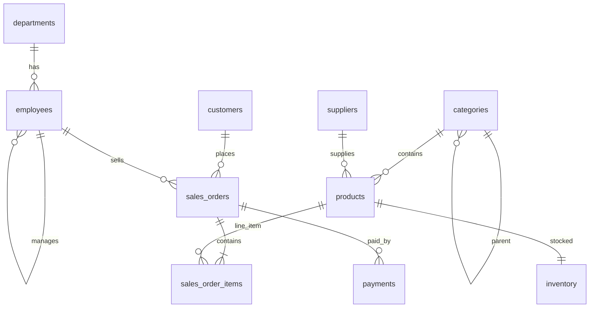

# SQL Practice Lab

A local Docker-based database environment with a realistic retail dataset for SQL practice,
interviews, and learning. **Oracle XE is the primary database**; PostgreSQL is included as a
faster, lighter alternative when you don't need Oracle-specific syntax.

## Quick Start (Windows) -- Oracle XE

**Prerequisites:** [Docker Desktop](https://www.docker.com/products/docker-desktop/) (WSL2
backend, 2 GB+ RAM available to Docker), Python 3.11+

```powershell
cd C:\Users\ricar\Projects\sql-practice-lab
copy .env.example .env
.\scripts\setup-oracle.ps1
```

This will:
1. Generate ~1,200 customers, 550 products, 5,200 orders, and related data
2. Start Oracle XE 21c in Docker (**first boot takes 2-5 minutes**)
3. Auto-create the schema, reference data, and data-quality fixtures on first init
4. Bulk-load the full dataset via a Python loader (`python-oracledb`, no Oracle Instant
   Client needed)
5. Verify minimum row counts

**Connect via SQL*Plus:**

```powershell
docker exec -it sql-practice-oracle sqlplus sqlstudent/OraclePractice2024!@XEPDB1
```

**Sample query:**

```sql
SELECT * FROM v_order_summary FETCH FIRST 10 ROWS ONLY;
```

Full details, trade-offs of the Docker image choice, and troubleshooting:
[oracle/README-oracle.md](oracle/README-oracle.md).

## Quick Start (Windows) -- PostgreSQL (faster alternative)

```powershell
cd C:\Users\ricar\Projects\sql-practice-lab
copy .env.example .env
.\scripts\setup.ps1
```

Starts in ~30 seconds instead of minutes, same dataset, ANSI SQL instead of PL/SQL. See
[PostgreSQL vs Oracle XE](#postgresql-vs-oracle-xe) below to decide which to use.

**Connect via psql:**

```powershell
docker exec -it sql-practice-postgres psql -U sqlstudent -d retail_dw
```

## Connection Details

| Setting  | Oracle XE                 | PostgreSQL          |
|----------|----------------------------|----------------------|
| Host     | `localhost`                | `localhost`           |
| Port     | `1521`                     | `5432`                |
| Database / Service | `XEPDB1`         | `retail_dw`            |
| User     | `sqlstudent`                | `sqlstudent`           |
| Password | `OraclePractice2024!`       | `SqlPractice2024!`     |
| Schema   | `SQLSTUDENT` (= the user)  | `retail`               |

### DBeaver / DataGrip

- Oracle: driver `Oracle`, URL `jdbc:oracle:thin:@localhost:1521/XEPDB1`
- PostgreSQL: driver `PostgreSQL`, URL `jdbc:postgresql://localhost:5432/retail_dw`, schema `retail`

## Project Structure

```
sql-practice-lab/
├── docker-compose.oracle.yml   # Oracle XE (primary)
├── docker-compose.yml          # PostgreSQL (alternative)
├── oracle/
│   ├── init/                   # Auto-run on first container init (as SYS, switches to SQLSTUDENT)
│   │   ├── 01_schema.sql       # Tables, indexes, views
│   │   ├── 02_dimensions.sql   # Departments, categories, suppliers, employees
│   │   └── 03_data_quality.sql # Hand-crafted messy data for DQ exercises
│   ├── seed/
│   │   ├── load_oracle.py      # Bulk loader (python-oracledb thin driver)
│   │   └── requirements.txt
│   └── README-oracle.md        # Full setup, image trade-offs, troubleshooting
├── postgres/
│   ├── init/                   # Auto-run on first container start
│   │   ├── 01_schema.sql
│   │   ├── 02_dimensions.sql
│   │   └── 03_data_quality.sql
│   └── seed/
│       ├── generate_data.py    # CSV generator (Faker, seed=42) -- shared by both DBs
│       ├── load_bulk.sql       # Bulk COPY load (run by setup.ps1)
│       └── data/                # Generated CSVs (gitignored)
└── scripts/
    ├── setup-oracle.ps1 / .sh  # Full Oracle setup
    ├── reset-oracle.ps1        # Destroy Oracle volume and rebuild
    ├── setup.ps1 / .sh         # Full PostgreSQL setup
    ├── generate-seed.ps1 / .sh # Regenerate shared CSVs only
    └── reset-db.ps1            # Destroy PostgreSQL volume and rebuild
```

The Oracle and PostgreSQL environments load from the **same generated CSVs**
(`postgres/seed/data/`) -- one generator, two loaders, so both databases contain the
identical dataset regardless of which one you practice on.

## Database Schema

Both databases implement the same model (`retail` schema in Postgres; the `SQLSTUDENT` user
schema in Oracle, since Oracle schemas and users are the same thing).



### Tables

| Table | Description | ~Rows |
|-------|-------------|-------|
| `departments` | Company departments | 8 |
| `employees` | Staff with manager hierarchy | 75 |
| `categories` | Product categories (2 levels) | 24 |
| `suppliers` | Product suppliers | 35 |
| `customers` | Customer master | 1,205 |
| `products` | Product catalog | 552 |
| `sales_orders` | Order headers | 5,203 |
| `sales_order_items` | Order line items | ~15,600 |
| `inventory` | Stock levels per product | 552 |
| `payments` | Payment transactions | ~5,800 |

### Practice Views

| View | Purpose |
|------|---------|
| `v_order_summary` | Order totals with customer and sales rep |
| `v_customer_ltv` | Customer lifetime value |
| `v_data_quality_issues` | Pre-flagged data inconsistencies |

## Data Characteristics

Designed for realistic SQL practice:

- **Date range:** 2020-2025 with Q4 seasonality and YoY growth
- **Regions:** NA (40%), EU (25%), LATAM (20%), APAC (15%)
- **Sales channels:** online, retail, phone, wholesale, marketplace
- **Null values:** ~8% in optional fields (email, phone, credit_limit, etc.)
- **Data quality fixtures:** duplicate emails, near-duplicate company names, shipped orders
  without dates, overpayments, duplicate payment references

### Sanity Check

Oracle:
```sql
SELECT 'customers' AS t, COUNT(*) AS n FROM customers
UNION ALL SELECT 'products', COUNT(*) FROM products
UNION ALL SELECT 'sales_orders', COUNT(*) FROM sales_orders
UNION ALL SELECT 'sales_order_items', COUNT(*) FROM sales_order_items
UNION ALL SELECT 'payments', COUNT(*) FROM payments;
```

PostgreSQL: same query, prefix each table with `retail.`.

Expected minimums: customers >= 1,000 | products >= 500 | orders >= 5,000

## SQL Practice Exercises

### Beginner

1. List top 10 customers by total order value
2. Find products with no category assigned
3. Count orders per region and sales channel

### Intermediate

4. Monthly revenue trend using date-truncation and window functions
5. Employees with more orders than their department average
6. Products where inventory is below reorder level
7. Customers who placed orders in consecutive months (gaps and islands)

### Advanced

8. Running total revenue per customer over time (`SUM() OVER`)
9. Cohort analysis: retention by customer signup month
10. Find duplicate emails and near-duplicate company names
11. Reconcile orders where total payments exceed order total
12. Rank sales reps by revenue within each region using `RANK()`
13. (Oracle only) Rewrite exercise 4 using `ROWNUM` instead of `FETCH FIRST`, and exercise 9
    using `CONNECT BY` to generate a month spine instead of a recursive CTE

### Data Quality

```sql
-- Use the built-in view
SELECT * FROM v_data_quality_issues;

-- Or find shipped orders missing ship date
SELECT order_number, status, shipped_at
FROM sales_orders
WHERE status = 'shipped' AND shipped_at IS NULL;
```

## Common Commands

```powershell
# Oracle
docker compose -f docker-compose.oracle.yml down        # stop
docker compose -f docker-compose.oracle.yml logs -f oracle-xe
.\scripts\reset-oracle.ps1                                # wipe + rebuild

# PostgreSQL
docker compose down
docker compose logs -f postgres
.\scripts\reset-db.ps1

# Regenerate the shared seed CSVs only (no DB changes)
.\scripts\generate-seed.ps1
```

## PostgreSQL vs Oracle XE

| Criterion | Oracle XE (primary) | PostgreSQL (alternative) |
|-----------|----------------------|----------------------------|
| Startup | 2-5 minutes | ~30 seconds |
| RAM | ~2 GB | ~256 MB |
| Setup | `.\scripts\setup-oracle.ps1` | `.\scripts\setup.ps1` |
| SQL syntax | `ROWNUM`, `NVL`, `DUAL`, PL/SQL | ANSI SQL, `LIMIT`, `ILIKE` |
| Dataset | Full (same as Postgres) | Full (5k+ orders) |

**Recommendation:** Use Oracle XE if you need Oracle-specific syntax (interviews, an
Oracle-based employer, PL/SQL practice) -- it's the default in this repo and has the complete
dataset. Fall back to PostgreSQL when you just want fast iteration on general SQL (JOINs,
CTEs, window functions) without the multi-minute Oracle startup.

See [oracle/README-oracle.md](oracle/README-oracle.md) for why `gvenzl/oracle-xe` was chosen
over Oracle's own container-registry image, and the trade-offs of each.

## Troubleshooting (Windows)

### Oracle: container never becomes healthy

First boot legitimately takes 2-5 minutes. Watch progress with:

```powershell
docker compose -f docker-compose.oracle.yml logs -f oracle-xe
```

### Port 5432 / 1521 already in use

```powershell
netstat -ano | findstr :5432
netstat -ano | findstr :1521
```

Change `POSTGRES_PORT` / `ORACLE_PORT` in `.env` and reconnect using the new port.

### Docker not running

Ensure Docker Desktop is started. Run `docker info` to verify.

### Init scripts did not run

Init scripts only execute on **first volume creation**. If you need a clean slate:

```powershell
.\scripts\reset-oracle.ps1   # Oracle
.\scripts\reset-db.ps1       # PostgreSQL
```

### WSL2 / Hyper-V issues

Docker Desktop on Windows requires the WSL2 backend. Enable virtualization in BIOS and
install the WSL2 kernel update from Microsoft.

## License

MIT -- use freely for learning and interview preparation.
